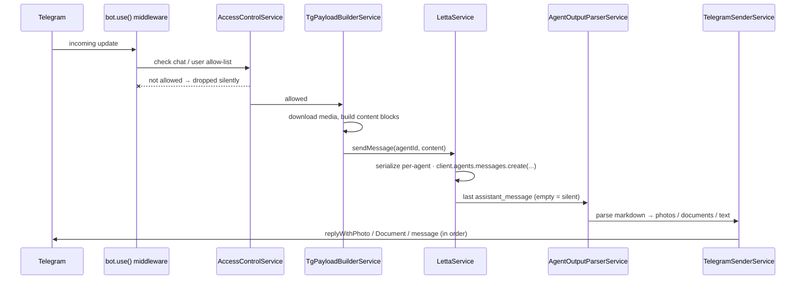

<div align="center">

# 🤖 letta-telegram

### Bridge any number of Telegram bots to [Letta](https://letta.com) agents — with one tiny NestJS process.

A lightweight, production-ready proxy that relays Telegram messages (text, photos, documents, voice) to stateful Letta agents and streams their replies back — including agent-generated images and files.

<br/>

[](https://nestjs.com)
[](https://www.typescriptlang.org)
[](https://telegraf.js.org)
[](https://letta.com)
[](https://hub.docker.com/r/nvxdm/letta-telegram)
[](#-license)

</div>

---

## ✨ Features

- 🔗 **1:1 bot ↔ agent binding** — each bot maps to a single Letta agent, with shared agent state across every chat it serves.
- 🚀 **Multi-bot, single process** — host **N** bots concurrently; each is configured purely through env vars, no code changes.
- 👥 **Group-chat aware** — every group message is relayed to the agent, and the agent decides whether to reply.
- 🔒 **Explicit allow-lists** — whitelist Telegram user IDs (DMs) and chat IDs (groups). Everything else is dropped silently.
- 🖼️ **Bidirectional media** — photos, documents, voice & audio flow both ways (see [Media support](#-media-support)).
- 🧩 **Zero hard-coded handlers** — a bot-agnostic middleware is bound to every Telegraf instance at startup, so the bot list grows straight from config.
- 🛡️ **Type-safe config** — environment variables validated at boot with [Zod](https://zod.dev); fail fast, not at runtime.
- 🐳 **Multi-arch Docker images** — `linux/amd64` + `linux/arm64`, published automatically on release.

## 📚 Table of Contents

- [Quick Start](#-quick-start)
- [Configuration](#-configuration)
- [Media Support](#-media-support)
- [Architecture](#-architecture)
- [How a Message Flows](#-how-a-message-flows)
- [Finding Chat IDs](#-finding-chat-ids)
- [Notes & Limitations](#-notes--limitations)
- [Tech Stack](#-tech-stack)
- [License](#-license)

## 🚀 Quick Start

### Local

```bash
cp .env.example .env
# edit .env: set LETTA_TOKEN, BOT_1_TOKEN, BOT_1_AGENT_ID, BOT_1_ALLOWED_USER_IDS, ...

yarn install
yarn build && yarn start
# …or for live reload during development:
yarn start:dev
```

### Docker

```bash
docker compose up --build
```

Or pull the prebuilt multi-arch image straight from Docker Hub:

```bash
docker run --env-file .env nvxdm/letta-telegram:latest
```

## ⚙️ Configuration

All configuration is done through environment variables. Copy `.env.example` to `.env` and fill in the blanks.

### Letta server

| Var | Required | Default | Notes |
|---|:---:|---|---|
| `LETTA_BASE_URL` | ✅ | — | e.g. `https://api.letta.com` or your self-hosted URL |
| `LETTA_TOKEN` | ✅ | — | Bearer token (a self-hosted server password works fine) |
| `LETTA_TIMEOUT_MS` | — | `120000` | Per-request timeout in ms |

### Per-bot block

Repeat the block for each bot — `BOT_1_*`, `BOT_2_*`, `BOT_3_*`, …

| Var | Required | Notes |
|---|:---:|---|
| `BOT_<N>_NAME` | ✅ | Human-readable name, must be unique across bots |
| `BOT_<N>_TOKEN` | ✅ | Telegram bot token from [@BotFather](https://t.me/BotFather) |
| `BOT_<N>_AGENT_ID` | ✅ | Letta agent id (e.g. `agent-b4c5…`) |
| `BOT_<N>_ALLOWED_USER_IDS` | ✅ | Comma-separated Telegram numeric user IDs · **empty = deny all DMs** |
| `BOT_<N>_ALLOWED_CHAT_IDS` | ✅ | Comma-separated group/supergroup IDs (negative numbers) · **empty = deny all groups** |

> [!IMPORTANT]
> **Indices must be contiguous starting at 1.** `BOT_1_*` is required if any bots are configured. Gaps are skipped (e.g. `BOT_1_*` then `BOT_3_*` with no `BOT_2_*` is tolerated), but the first index must be `1`.

### Misc

| Var | Default | Notes |
|---|---|---|
| `LOG_LEVEL` | `info` | One of `error`, `warn`, `info`/`log`, `debug`, `verbose` |
| `NODE_ENV` | — | `production` recommended in Docker |

## 🖼️ Media Support

| Direction | Type | Handling |
|---|---|---|
| **TG → Letta** | Photos | Sent inline as base64 |
| **TG → Letta** | Documents | Uploaded to a per-bot Letta files folder attached to the agent |
| **TG → Letta** | Voice / Audio | Uploaded as files |
| **Letta → TG** | `` | Sent as a **photo** |
| **Letta → TG** | `[label](url)` *(with file extension)* | Sent as a **document** |
| **Letta → TG** | Remaining text | Sent as a **message** |

## 🏗️ Architecture

```
src/
├── config/         # Env parsing + Zod validation (bots, letta)
├── letta/          # @letta-ai/letta-client wrapper + per-agent serialization
├── media/          # Telegram file download, TG→Letta payload, agent output parser
├── bots/           # Bot launcher (Telegraf), access control, update handler, sender
├── common/         # Logger setup + global exception filter
├── app.module.ts
└── main.ts
```

The handler middleware (`telegram-update.handler.ts`) is **bot-agnostic** and is bound at startup to every configured Telegraf instance via `bot.use(...)`. This avoids hard-coded `@Update()` classes and lets the bot list grow purely from env config.

## 🔄 How a Message Flows



1. **Telegram → middleware** — `bot.use(...)` fires for the configured bot.
2. **Access control** — `AccessControlService` checks the chat/user allow-list. Non-allowed updates are dropped silently.
3. **Payload build** — `TgPayloadBuilderService` converts the update into Letta `content` blocks. Media is downloaded; documents/voice/audio are uploaded to a per-bot Letta folder attached to the agent.
4. **Send to agent** — `LettaService.sendMessage(agentId, content)` calls `client.agents.messages.create(...)`. Calls to the same agent are **serialized in-process** to avoid concurrent-message undefined behavior.
5. **Extract reply** — the last `assistant_message` from the response is extracted. Empty text = silent (no reply).
6. **Parse output** — `AgentOutputParserService` parses markdown for photos/documents.
7. **Send back** — `TelegramSenderService` sends photos, documents, and text in order via `ctx.replyWith*`.

## 🔎 Finding Chat IDs

- **DMs** — each user has a numeric ID. Easiest: ask the user to message [@userinfobot](https://t.me/userinfobot); it replies with their ID.
- **Groups** — add the bot to a group, then have *any* user send a message. The first dropped update logs `chat <ID> not in BOT_*_ALLOWED_CHAT_IDS` — that's the ID to add.

## 📝 Notes & Limitations

- 📡 **Long-polling only** — no webhook server is exposed.
- 🎙️ **No voice transcription** in this service — the agent (or its tools) is responsible.
- 🚫 **Stickers and videos** are not currently relayed.
- 🔁 **Per-agent serialization** — the Letta server warns against concurrent messages to the same agent, so `LettaService` serializes them per-agent.

## 🧰 Tech Stack

- **[NestJS](https://nestjs.com)** 10 — application framework
- **[Telegraf](https://github.com/telegraf/telegraf)** — Telegram bot framework ([`nestjs-telegraf`](https://github.com/nksmnf/nestjs-telegraf) installed for future decorator extensions)
- **[`@letta-ai/letta-client`](https://github.com/letta-ai/letta-node)** — official Letta SDK
- **[Zod](https://zod.dev)** — runtime env validation
- **TypeScript · Jest · Docker (multi-arch)**

## 📄 License

Released under the [MIT License](LICENSE). © 2026 Dmytro.

<div align="center">
<br/>
<sub>Built with NestJS · Powered by <a href="https://letta.com">Letta</a> agents</sub>
</div>
